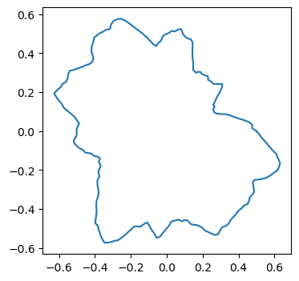
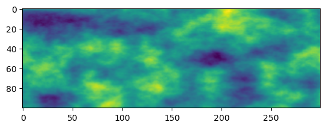

# Table of Contents

1.  [Vectorized value & gradient noise with NumPy](#orgbb574ca)
    1.  [Install with PIP](#orgb8797b4)
    2.  [Install locally](#orgc1c290b)
    3.  [Examples](#org4f08302)

# Vectorized value & gradient noise with NumPy

Rumore is a lightweight Python library for procedural noise. It provides **value noise** and **gradient noise** in **1D/2D/3D** plus **octave summation** of these (fractal Brownian motion, fBm).

The library does not implement Ken Perlin’s original algorithm directly, but its gradient noise produces visually similar results.

## Install with PIP

    pip install rumore

## Install locally

Clone the repo, navigate to the directory and from there

    pip install -e .

## Examples

Import necessary stuff

    from importlib import reload
    import matplotlib.pyplot as plt
    import numpy as np
    import rumore
    #reload(rumore)

Generate some 1d gradient noise with different number of octaves

    x = np.linspace(-10, 10, 200)
    plt.figure(figsize=(5,4))
    for i in range(1, 3):
        plt.plot(x, rumore.grad_noise(x, octaves=i))
    plt.show()

Perturb points along a circle with 2d noise

    t = np.linspace(0, np.pi*2, 200)
    x = np.cos(t)
    y = np.sin(t)
    r = rumore.grad_noise(x, y)*0.5+0.5
    plt.figure(figsize=(4,4))
    plt.plot(x*r, y*r)
    plt.show()

Generate a grid of 2d noise value (a grayscale image)

    reload(rumore)
    x = np.linspace(0, 5, 300)
    y = np.linspace(0, 3, 100)
    img = rumore.noise_grid(x, y)
    plt.imshow(img)
    plt.show()

